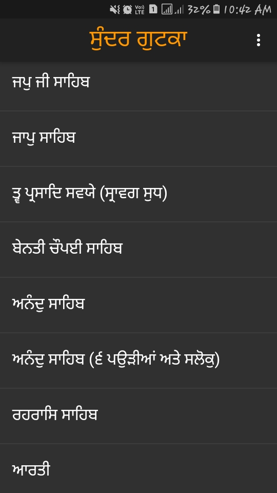
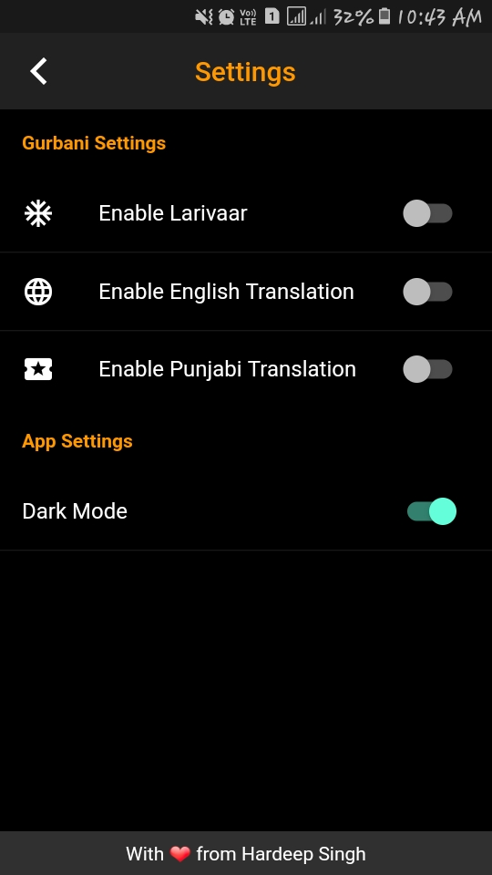
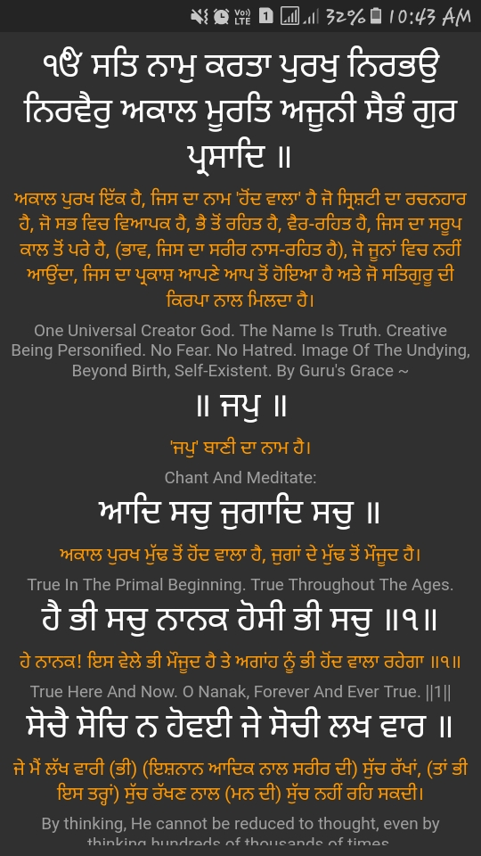
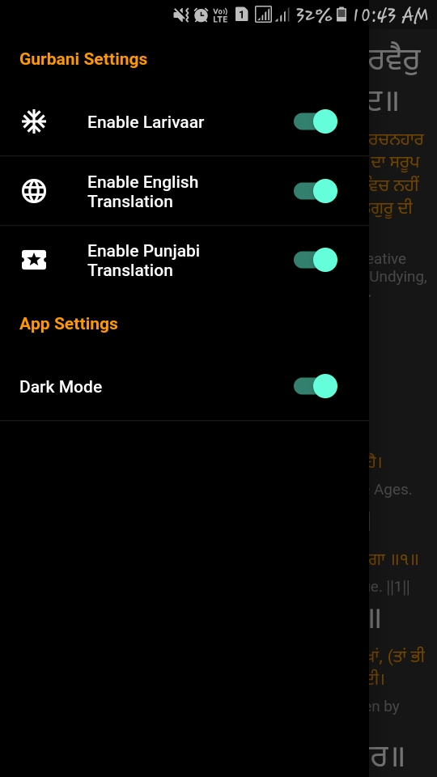
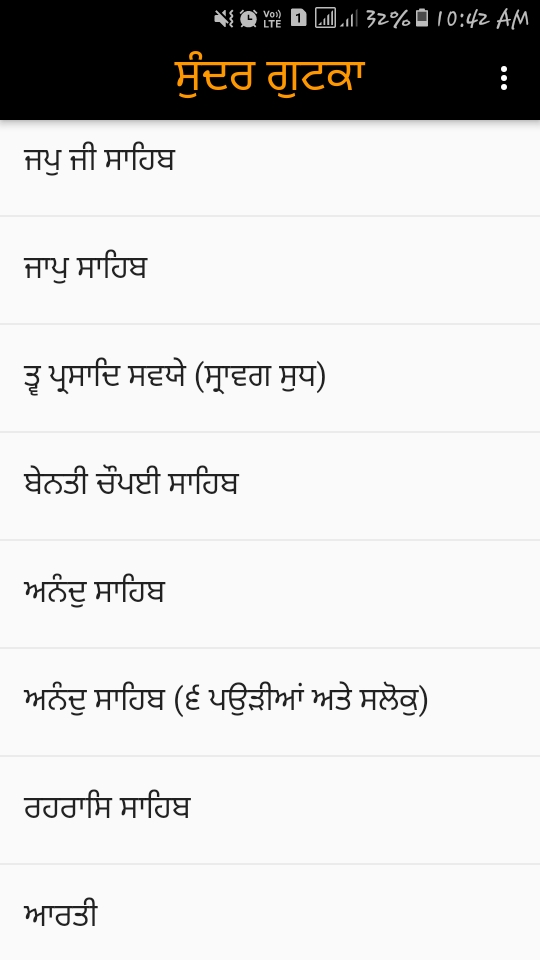
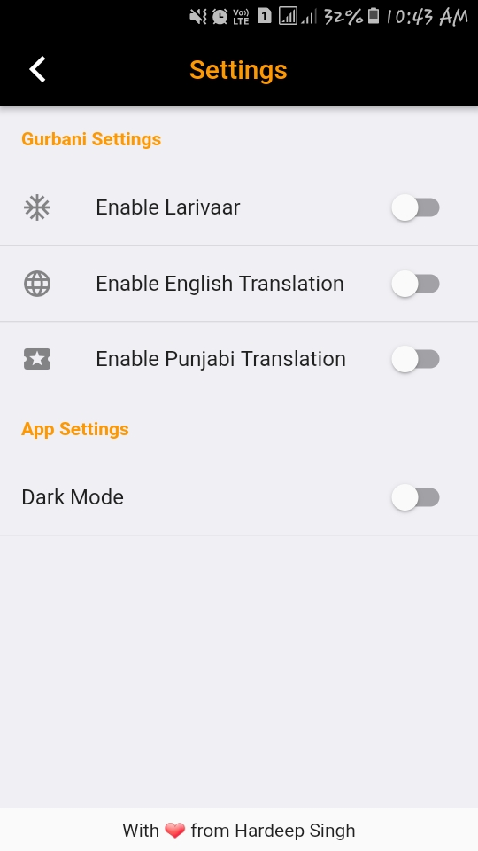
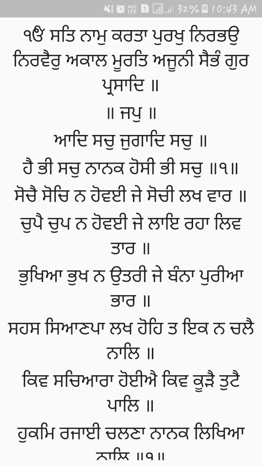

# Sundar Gutka

Sundar Gutka with all the banis with punjabi and english translation. It also include larivaar bani.

## 1. Introduction
Sundar Gutka is an open source Mobile app which features all the banis of sundar gutka with punjabi and english translation in a convenient way. This also features larivaar bani for someone who want it. This project is completely open source, feel free to make contribution.

## 2. Features in Development

This app is pretty stable, but I am trying my best to make it better everytime. Some new expected features are Auto Scroll Bani and option for custom theme. Feel free to reach out and suggest some more features.

## 3. Get it for You

#### 3.2.1 For Developers
1. Clone this project.
2. Run `flutter run`
#### 3.2.2 For Everyone
1. Download from [playstore](https://play.google.com/store/apps/details?id=com.hardeep.sundargutka).

## 4. Screenshots

#### 4.3.1 Dark Mode

  
  
   
  
  

#### 4.3.2 Light Mode

  
  
   
  
  

## Contributions

Contributions of anytype are totally accepted to this project. You can contibution by:- 
#### 1. Adding more features to the app.

You can fork this repo and add features. Then you can raise a pull request. I will review your request as soon as possible and merge it.

#### 2. Adding more banis to the app.

You can also add some more banis, if you have proper larivaar, punjabi translation and english translation of the bani. You can use [this file](https://github.com/Hardeepsingh980/Sundar-Gutka/blob/master/convertToMyConventionJson.py) to properly format your bani data.

#### 3. Uploding this app to playstore.

I don't own a playstore developer account. If you have one, please reach me out at hardeep0khalsa122@gmail.com, if you can help this app reach playstore.

#### 4. Compliling for IOS.

I don't have a mac. If you have one, Please help to complile this app for ios as well. Future uploading to app store would be really helpful.
