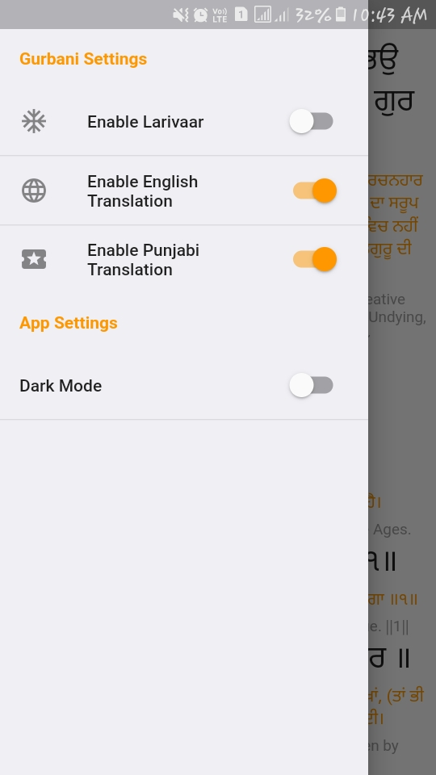

# Sundar Gutka

Sundar Gutka with all the banis with punjabi and english translation. It also include larivaar bani.

## 1. Introduction
Sundar Gutka is an open source Mobile app which features all the banis of sundar gutka with punjabi and english translation in a convenient way. This also features larivaar bani for someone who want it. This project is completely open source, feel free to make contribution.

### 1.1 Features in Development

This app is pretty stable, but I am trying my best to make it better everytime. Some new expected features are Auto Scroll Bani, option for changing font size, and option for custom theme. Feel free to reach out and suggest some more features.

### 1.2 Screenshots

#### Dark Mode

  
  
   
  
  

#### Light Mode

  
  
   
  
  

